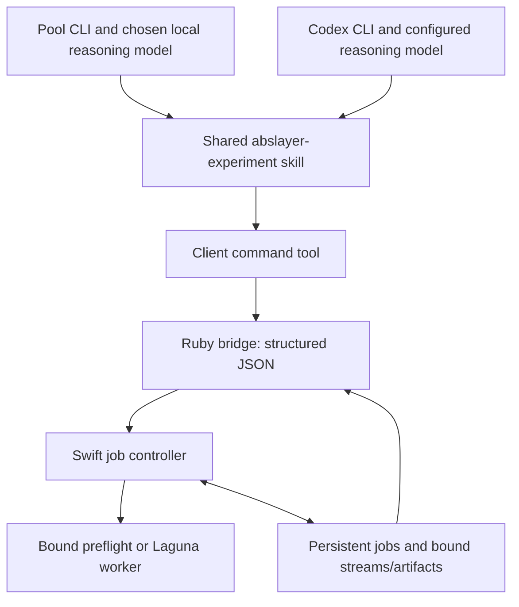

**ABSlayer with Pool CLI and Codex CLI — durable experiment harness, September 5, 2026**

Pool CLI or Codex CLI supplies the agent harness: conversation, model connection,
skill loading, and tool-calling loop. ABSlayer supplies one shared project skill,
a Ruby command bridge, and a durable Swift job controller. No MCP or separate
ABSlayer model loop is involved.

**Available now**

The bridge always implements `workspace_preflight`: evaluate this workspace's
complete SwiftPM manifest using `swift package dump-package`. A configured host
can additionally expose an authorized Laguna screen, reviewed control-vector
generation, and an independent private development comparison. Jobs are
persisted before acknowledgement, run in a detached local process, and can be
inspected from a fresh invocation of either client's command tool.



The local model option is for the research agent's reasoning, separate from the
model under experiment or an evaluation judge. Pool documents OpenAI-compatible
endpoints and a local inference route. Endpoint/model selection remains in the
client; ABSlayer does not change that configuration or introduce paid fallback.
See [Pool CLI](https://docs.poolside.ai/cli/cli-reference) and
[Poolside's local inference example](https://poolside.ai/blog/introducing-laguna-xs2-m1).

**Use from either client**

Start Pool CLI or Codex CLI in the project directory, then invoke
`$abslayer-experiment` for a listed operation or job management. Both products
document `.agents/skills/` discovery. The skill calls the client's existing
command tool; installing it does not inject custom native functions. See
[Pool skills](https://docs.poolside.ai/skills) and
[Codex skills](https://learn.chatgpt.com/docs/build-skills).

The bridge accepts one JSON argument or a JSON object on stdin. These commands
are run from the product directory:

```sh
ruby Scripts/abslayer-tool.rb '{"method":"capabilities"}'

ruby Scripts/abslayer-tool.rb <<'JSON'
{"method":"submit","operation":"workspace_preflight","idempotencyKey":"preflight-attempt-1","timeoutSeconds":60}
JSON
```

Use the returned `job.id` below:

```json
{"method":"status","jobID":"RETURNED_JOB_ID"}
{"method":"cancel","jobID":"RETURNED_JOB_ID"}
{"method":"evidence","jobID":"RETURNED_JOB_ID","stream":"stderr","offset":0,"limit":4096}
{"method":"recover"}
```

Send each object separately to the bridge. `status` without a job ID lists the
latest 20 jobs. `evidence` supports `stdout` or `stderr` and at most 8192 bytes per
request; use `nextOffset` for another page. Reads verify output hashes and are
available only after the supervisor has recorded terminal evidence. Running logs
are not presented as immutable evidence.

Use one idempotency key per intended run. Repeating it with the same request and
input identities returns the original job. Changing inputs, timeout, runtime
configuration, or controller binary under the same key returns a conflict. An
intentional new attempt needs a new key. The worker timeout is 1–3600 seconds and
does not include initial controller compilation or queue waiting.

Responses are JSON on stdout; build diagnostics go to stderr. They include `ok`,
structured errors when applicable, compact job state, the request digest, and
output artifact references. Detailed inputs, resolved arguments/environment,
controller/executable hashes, events, and timestamps are in the referenced
`stateFile`. `completed` means the configured worker returned a valid result and
all declared artifacts matched their reported paths, sizes, and hashes;
`acceptance` is always `not_evaluated`. Model quality still requires separate
refusal, completion, correctness, and retention judgments.

**Build and layout**

Swift 6.3+ and Ruby are required. The bridge builds the controller on first use
and rebuilds when its source/toolchain fingerprint changes. To build explicitly:

```sh
ruby Scripts/build-harness.rb build
```

The helper stages the package manifest and links the real source/test directories
into `.build-harness/package`. `ABSLAYER_HARNESS_ONLY=1` selects only the controller
and its tests in that staged graph. On macOS these use Foundation and CryptoKit,
with no external packages. On Linux they use the existing pinned swift-crypto
version; the isolated controller has also been exercised on the Laguna host.

This build isolation avoids resolving or rewriting the original engine's
`Package.resolved`. Default product builds still include the retained native
workers, pins, patches, and tests, plus the new controller targets. The helper
uses local compiler/package caches. SwiftPM's nested manifest sandbox is disabled
for these trusted local manifest checks; the calling client's execution sandbox
and permissions still apply.

```text
.agents/skills/abslayer-experiment/SKILL.md  shared Pool/Codex workflow
Scripts/abslayer-tool.rb                   JSON bridge and detached host startup
Scripts/build-harness.rb                  isolated SwiftPM build/test helper
Sources/ABSlayerHarness/
  Contracts.swift                        requests, compact results, job schema
  Persistence.swift                      hashes, locks, atomic state publication
  Harness.swift                          submission, validation, lifecycle, evidence
  SpawnedWorker.swift                    process group, output files, inherited lease
Sources/ABSlayerJobHost/main.swift          internal request/drain entrypoint
Tests/ABSlayerHarnessTests/                synthetic Swift controller tests
Tests/HarnessIntegrationTests.rb           detached-process and real preflight checks
Tests/LagunaWorkerTests.rb                  fake-server screening/vector contract checks
Tests/LagunaIndependentVerifyTests.rb       fake-server development cohort checks
.abslayer/state/                          generated private state and job artifacts
```

`ABSLAYER_STATE_DIR` can select an isolated state directory for tests. Both
clients must use the same state location to share jobs. `ABSLAYER_SWIFT` can
select an absolute Swift executable. `ABSLAYER_RUBY` is resolved and supplied by
the Ruby bridge, so a worker never depends on an unbound `PATH` lookup.

On a Laguna host, the complete following group registers
`laguna_authorized_screen`:

```text
ABSLAYER_LAGUNA_AUTHORIZED_SCREEN_WORKER
ABSLAYER_LAGUNA_SERVER
ABSLAYER_LAGUNA_MODEL
ABSLAYER_LAGUNA_AUTHORIZED_DATASET
ABSLAYER_LAGUNA_AUTHORIZED_MANIFEST
ABSLAYER_LAGUNA_AUTHORIZED_SCREEN_OUTPUT
ABSLAYER_LAGUNA_AUTHORIZED_SCREEN_MODE   # balanced (default), ssrf, pairable, or full
```

The screen validates train-split, same-operation synthetic provenance, selects
sorted authorized `control` records, and records visible content separately from
hidden reasoning and finish reason. It uses an authenticated per-run localhost
server and checkpoints each response. Saved rows are revalidated against their
raw response bodies and dataset identity before reuse. The final private response
file is a declared controller-bound artifact. Regex matches only identify records
for semantic review. `balanced` retains the two-record-per-category development
screen, while `ssrf` retains all records from the three SSRF-related categories.
For the legacy 40-category source dataset, `pairable` requires six request types
and seven records in every category/request-type cell, then selects the first two
stable record IDs per cell (480 total). `full` selects all seven records per cell
(1,680 total). A newer manifest may declare its exact category list, request-type
list, and rows per cell in `coverage_requirements`; the same pairable/full rules
then apply to that declared matrix. These broad modes fail closed on missing,
extra, or uneven cells so a partial dataset cannot be reported as full coverage.

The complete following group registers `laguna_reviewed_vector`:

```text
ABSLAYER_LAGUNA_REVIEWED_VECTOR_WORKER
ABSLAYER_LAGUNA_REVIEWED_SELECTION
ABSLAYER_LAGUNA_REVIEWED_SCREEN_RESULTS
ABSLAYER_LAGUNA_AUTHORIZED_DATASET
ABSLAYER_LAGUNA_AUTHORIZED_MANIFEST
ABSLAYER_LAGUNA_MODEL
ABSLAYER_LAGUNA_SERVER
ABSLAYER_LAGUNA_GENERATOR
ABSLAYER_LAGUNA_REVIEWED_VECTOR_OUTPUT
```

Its schema-2 selection must bind every input identity plus the full reviewer
rubric and per-pair notes. Each side is resolved back to a completed authorized
screen response and dataset control. Pairs must have reviewed false-refusal/
substantive-compliance outcomes, the same category and request type, distinct
unreused prompts, and rendered byte lengths within 0.8–1.25. The worker re-renders
the exact Laguna template and checks it against the screen hash. It then calls the
authenticated llama.cpp `/tokenize` endpoint for every rendered side with special
token insertion and special-token parsing enabled. This matches Laguna's enabled
GGUF add-BOS setting and the rendered-prompt tokenization in the inspected
generator implementation; the chat template itself does not emit BOS. The worker
requires nonempty integer token IDs and one shared final assistant-generation
boundary token, and applies the same 0.8–1.25 balance range to token counts. The result
records those counts and the boundary token. Its explicit algorithm provenance
describes final-rendered-token capture, false-refusal minus compliance directions,
per-layer arithmetic mean followed by L2 normalization, and subtraction at the
runtime `-0.25` scale. It binds the generator executable by SHA-256 without
claiming an unavailable source-to-binary attestation. The worker preserves prompt
escape bytes, validates the GGUF header and a target-runtime load, and publishes a
declared controller-bound `control-vector.gguf`. The withdrawn
`laguna_control_vector` and `laguna_vector_screen` operations are unavailable.

These values are host configuration, never JSON request fields. Every input is
identity-bound when a job is submitted, and successful execution leaves
acceptance as `not_evaluated`.
An independent private verification can be registered with
`ABSLAYER_LAGUNA_VERIFY_WORKER`, `ABSLAYER_LAGUNA_SERVER`,
`ABSLAYER_LAGUNA_MODEL`, `ABSLAYER_LAGUNA_VECTOR`,
`ABSLAYER_LAGUNA_VERIFY_FIXTURE`, and `ABSLAYER_LAGUNA_VERIFY_OUTPUT`;
`ABSLAYER_LAGUNA_VERIFY_SCALE` defaults to `-0.25`.
The preferred schema-2 fixture must identify itself as development and
not-held-out, declare exact cohort counts, and classify every cohort exactly once
as authorized, benign, or protected-boundary. Record IDs and prompts must be
nonempty, IDs must be unique, and every record must have nonempty marker groups.
The worker refuses incomplete or overlapping coverage before inference. The
legacy fixed 8-authorized-SSRF/4-benign/4-sensitive schema-1 layout remains
readable as development evidence.

Results report refusal, visibility, stop, and marker counts per condition and
cohort. Authorized refusal-to-answer flips, benign marker retention, and
protected-boundary refusal retention are separate transition counts. Server,
model, vector, and fixture hashes bind the comparison. The artifact remains a
private development comparison with `acceptance: not_evaluated`; it is not a
sealed or held-out evaluation.
These are local support settings, not parameters a JSON request can turn into
arbitrary worker commands.

Configured executables, input files, their parent directories, state, and artifact
destinations are a trusted local-storage boundary. Hash checks detect accidental
or persistent drift; they do not isolate the controller from a malicious process
running as the same user and swapping a configured path during execution.

**Execution and recovery guarantees**

State changes use a separate file lock and atomic, fsynced publication. A request
and its input identities are saved before submission returns. The background
host drains the queue and exits when idle. Releasing its execution lease under
the state lock prevents a racing submission from being stranded at idle exit.

A single supervisor owns the execution lease for a state directory. The direct
worker inherits that lease, so abrupt supervisor death cannot immediately allow
a second worker to overlap it. On a later status/cancel/recover request, the bridge
starts a reconciliation attempt. Once the old worker releases the lease, the old
job becomes `interrupted`; it is never silently marked successful or retried.
Queued work can then continue. This does not implement exact worker resume.

Normal cancellation and timeout signal the worker's process group, escalating to
termination if needed. Terminal state is recorded after the direct worker is
reaped. Output is monitored against a 2 MiB budget; this is a polling limit, not
an exact filesystem quota. Output hashes and bound input/controller identities
are checked before successful completion. Declared worker artifacts must also be
regular files whose paths, byte counts, and hashes match the worker result. A
specific status or evidence read rechecks every recorded output and detects
post-completion tampering. Declared artifacts are capped at 64 MiB before hashing.
A zero exit alone is insufficient: stdout must contain
the operation's typed completion object (or a SwiftPM manifest for preflight).

If a supervisor crashes and its worker hangs, the inherited lease deliberately
keeps subsequent work blocked. This version does not guess that a recorded PID
is still safe to kill. Normal timeout supervision is unavailable after that
supervisor dies. These guarantees cover the registered direct worker and
cooperating process-group descendants, not arbitrary detached subprocess trees.
One state directory serializes its configured workers; GPU allocation across
multiple state directories is not yet coordinated.

**Verified and remaining**

Run the checks with:

```sh
ruby Scripts/build-harness.rb test
ruby Tests/HarnessIntegrationTests.rb
ruby Tests/LagunaWorkerTests.rb
ruby Tests/LagunaIndependentVerifyTests.rb
```

The checks cover request validation, idempotency conflicts, input drift,
cancellation, timeout, competing supervisors, malformed/oversized output,
artifact tampering, corrupt state, and real process-level crash recovery. The
integration suite also executes the real SwiftPM preflight through the bridge
and verifies that dependency pins remain unchanged. The Laguna worker suites use
fake authenticated model servers and a fake generator to verify authorized-only
selection, exact template bytes, checkpoint recovery, reviewed provenance,
declared vector binding, development cohort validation, and separated transition
metrics without loading model weights.

The shared Pool/Codex skill layout and frontmatter are validated. The controller
and Laguna runtime have been exercised on the Linux experiment host. The corrected
reviewed-vector gate is contract-tested and awaits an eligible real pair. The full
Swift/MLX engine build and a final accepted model remain separate.

Multi-candidate experiments, the native model-preflight adapter, explicit GPU
allocation across state directories, permanent-weight export, calibrated
judgments, and scientific acceptance remain future work. Their deterministic
policy belongs in Swift. Keep refusal reduction, answer completion, task
correctness, and capability retention distinct. Shared skills should continue to
receive compact summaries and request detailed evidence only when needed.
