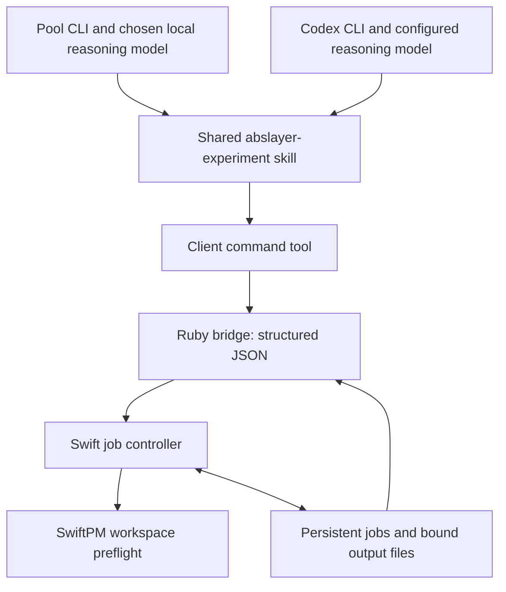

**ABSlayer with Pool CLI and Codex CLI — first working slice, September 4, 2026**

Pool CLI or Codex CLI supplies the agent harness: conversation, model connection,
skill loading, and tool-calling loop. ABSlayer supplies one shared project skill,
a Ruby command bridge, and a durable Swift job controller. No MCP or separate
ABSlayer model loop is involved.

**Available now**

The bridge always implements `workspace_preflight`: evaluate this workspace's complete
SwiftPM manifest using `swift package dump-package`. It does not resolve model
dependencies, load model weights, or read datasets. Jobs are persisted before
acknowledgement, run in a detached local process, and can be inspected from a
fresh invocation of either client's command tool.



The local model option is for the research agent's reasoning, separate from the
model under experiment or an evaluation judge. Pool documents OpenAI-compatible
endpoints and a local inference route. Endpoint/model selection remains in the
client; ABSlayer does not change that configuration or introduce paid fallback.
See [Pool CLI](https://docs.poolside.ai/cli/cli-reference) and
[Poolside's local inference example](https://poolside.ai/blog/introducing-laguna-xs2-m1).

**Use from either client**

Start Pool CLI or Codex CLI in the project directory, then invoke
`$abslayer-experiment` for workspace preflight or job management. Both products
document `.agents/skills/` discovery. The skill calls the client's existing
command tool; installing it does not inject custom native functions. See
[Pool skills](https://docs.poolside.ai/skills) and
[Codex skills](https://learn.chatgpt.com/docs/build-skills).

The bridge accepts one JSON argument or a JSON object on stdin. These commands
are run from the product directory:

```sh
ruby Scripts/abslayer-tool.rb '{"method":"capabilities"}'

ruby Scripts/abslayer-tool.rb <<'JSON'
{"method":"submit","operation":"workspace_preflight","idempotencyKey":"preflight-attempt-1","timeoutSeconds":60}
JSON
```

Use the returned `job.id` below:

```json
{"method":"status","jobID":"RETURNED_JOB_ID"}
{"method":"cancel","jobID":"RETURNED_JOB_ID"}
{"method":"evidence","jobID":"RETURNED_JOB_ID","stream":"stderr","offset":0,"limit":4096}
{"method":"recover"}
```

Send each object separately to the bridge. `status` without a job ID lists the
latest 20 jobs. `evidence` supports `stdout` or `stderr` and at most 8192 bytes per
request; use `nextOffset` for another page. Reads verify output hashes and are
available only after the supervisor has recorded terminal evidence. Running logs
are not presented as immutable evidence.

Use one idempotency key per intended run. Repeating it with the same request and
input identities returns the original job. Changing inputs, timeout, runtime
configuration, or controller binary under the same key returns a conflict. An
intentional new attempt needs a new key. The worker timeout is 1–120 seconds and
does not include initial controller compilation or queue waiting.

Responses are JSON on stdout; build diagnostics go to stderr. They include `ok`,
structured errors when applicable, compact job state, the request digest, and
output artifact references. Detailed inputs, resolved arguments/environment,
controller/executable hashes, events, and timestamps are in the referenced
`stateFile`. `completed` means manifest preflight completed; `acceptance` is
always `not_evaluated`. There are no model-quality or capability metrics here.

**Build and layout**

Swift 6.3+ and Ruby are required. The bridge builds the controller on first use
and rebuilds when its source/toolchain fingerprint changes. To build explicitly:

```sh
ruby Scripts/build-harness.rb build
```

The helper stages the package manifest and links the real source/test directories
into `.build-harness/package`. `ABSLAYER_HARNESS_ONLY=1` selects only the controller
and its tests in that staged graph. On macOS these use Foundation and CryptoKit,
with no external packages. On Linux they use the existing pinned swift-crypto
version; the Linux build has not been exercised in this workspace.

This build isolation avoids resolving or rewriting the original engine's
`Package.resolved`. Default product builds still include the retained native
workers, pins, patches, and tests, plus the new controller targets. The helper
uses local compiler/package caches. SwiftPM's nested manifest sandbox is disabled
for these trusted local manifest checks; the calling client's execution sandbox
and permissions still apply.

```text
.agents/skills/abslayer-experiment/SKILL.md  shared Pool/Codex workflow
Scripts/abslayer-tool.rb                   JSON bridge and detached host startup
Scripts/build-harness.rb                  isolated SwiftPM build/test helper
Sources/ABSlayerHarness/
  Contracts.swift                        requests, compact results, job schema
  Persistence.swift                      hashes, locks, atomic state publication
  Harness.swift                          submission, validation, lifecycle, evidence
  SpawnedWorker.swift                    process group, output files, inherited lease
Sources/ABSlayerJobHost/main.swift          internal request/drain entrypoint
Tests/ABSlayerHarnessTests/                synthetic Swift controller tests
Tests/HarnessIntegrationTests.rb           detached-process and real preflight checks
.abslayer/state/                          generated private state and job artifacts
```

`ABSLAYER_STATE_DIR` can select an isolated state directory for tests. Both
clients must use the same state location to share jobs. `ABSLAYER_SWIFT` can
select an absolute Swift executable. On a Laguna host, setting the complete
`ABSLAYER_LAGUNA_WORKER`, `ABSLAYER_LAGUNA_MODEL`, `ABSLAYER_LAGUNA_DATASET`,
`ABSLAYER_LAGUNA_GENERATOR`, and `ABSLAYER_LAGUNA_OUTPUT` group registers
`laguna_control_vector`. The corresponding screen group is
`ABSLAYER_LAGUNA_SCREEN_WORKER`, `ABSLAYER_LAGUNA_SERVER`,
`ABSLAYER_LAGUNA_MODEL`, `ABSLAYER_LAGUNA_VECTOR`,
`ABSLAYER_LAGUNA_SCREEN_DATASET`, and `ABSLAYER_LAGUNA_SCREEN_OUTPUT`;
`ABSLAYER_LAGUNA_SCREEN_SCALE` defaults to `-0.5`. These values are host
configuration, never JSON request fields. Every file is identity-bound when a
job is submitted, and successful execution leaves acceptance as `not_evaluated`.
An independent private verification can be registered with
`ABSLAYER_LAGUNA_VERIFY_WORKER`, `ABSLAYER_LAGUNA_SERVER`,
`ABSLAYER_LAGUNA_MODEL`, `ABSLAYER_LAGUNA_VECTOR`,
`ABSLAYER_LAGUNA_VERIFY_FIXTURE`, and `ABSLAYER_LAGUNA_VERIFY_OUTPUT`;
`ABSLAYER_LAGUNA_VERIFY_SCALE` defaults to `-0.25`.
These are local support settings, not parameters a JSON request can turn into
arbitrary worker commands.

**Execution and recovery guarantees**

State changes use a separate file lock and atomic, fsynced publication. A request
and its input identities are saved before submission returns. The background
host drains the queue and exits when idle. Releasing its execution lease under
the state lock prevents a racing submission from being stranded at idle exit.

A single supervisor owns the execution lease for a state directory. The direct
worker inherits that lease, so abrupt supervisor death cannot immediately allow
a second worker to overlap it. On a later status/cancel/recover request, the bridge
starts a reconciliation attempt. Once the old worker releases the lease, the old
job becomes `interrupted`; it is never silently marked successful or retried.
Queued work can then continue. This does not implement exact worker resume.

Normal cancellation and timeout signal the worker's process group, escalating to
termination if needed. Terminal state is recorded after the direct worker is
reaped. Output is monitored against a 2 MiB budget; this is a polling limit, not
an exact filesystem quota. Output hashes and bound input/controller identities
are checked before successful completion. A zero exit alone is insufficient:
stdout must also contain a SwiftPM manifest object.

If a supervisor crashes and its worker hangs, the inherited lease deliberately
keeps subsequent work blocked. This version does not guess that a recorded PID
is still safe to kill. Normal timeout supervision is unavailable after that
supervisor dies. These guarantees cover the registered direct worker and
cooperating process-group descendants, not arbitrary detached subprocess trees.
Model/GPU jobs are not enabled in this version.

**Verified and remaining**

Run the checks with:

```sh
ruby Scripts/build-harness.rb test
ruby Tests/HarnessIntegrationTests.rb
```

The checks cover request validation, idempotency conflicts, input drift,
cancellation, timeout, competing supervisors, malformed/oversized output,
artifact tampering, corrupt state, and real process-level crash recovery. The
integration suite also executes the real SwiftPM preflight through the bridge
and verifies that dependency pins remain unchanged. No model inference or
training is involved.

The installed CLIs report Pool 1.0.16 and Codex 0.142.5. Their shared skill layout
is documented and the skill's frontmatter was validated. Actual model-driven
Pool/Codex sessions, a specific local inference server, Linux compilation, and
the full Swift/MLX engine build have not been tested by this milestone.

Multi-candidate experiments, the native model-preflight adapter, GPU resource
coordination, training/evaluation/export submissions, calibrated judgments, and
scientific acceptance remain future work. Their deterministic policy belongs in
Swift. Keep refusal reduction, answer completion, task correctness, and capability
retention distinct when adding those operations. Shared skills should continue
to receive compact summaries and request detailed evidence only when needed.
