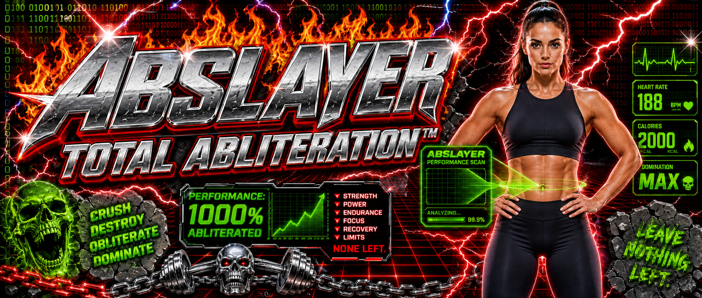

<p align="center">
  
</p>

<h1 align="center">ABSlayer</h1>

<p align="center">
  A Swift engine for reproducible model abliteration and cybersecurity evaluation.
</p>

<p align="center">
  
  
  <a href="LICENSE"></a>
  
</p>

ABSlayer measures model behavior, applies controlled interventions, and evaluates
the resulting tradeoffs. The product combines an existing Swift/MLX research
engine with a new durable Swift experiment controller. Ruby provides a small
command bridge and supporting tools. Python is not required.

**Pool CLI and Codex CLI provide the agent interface.** A shared project skill
uses their existing command tools to operate ABSlayer. The client owns the
conversation and reasoning-model connection; ABSlayer owns job execution, state,
resource policy, and evidence. Pool's documented local inference option allows
the reasoning model to run locally. This integration uses shared skills and
structured commands, without an MCP server or a separate ABSlayer agent loop.

## What works today

| Component | Available now |
| --- | --- |
| Swift/MLX research engine | Activation capture, refusal-subspace analysis, residual and weight interventions, adapter training, retention measurements, and export workers |
| Swift job controller | Durable workspace-preflight jobs, idempotent submission, status, cancellation, timeout handling, and interrupted-job reconciliation |
| Agent integration | Shared `abslayer-experiment` skill and a Ruby JSON bridge for Pool CLI and Codex CLI |
| Evidence | Bounded terminal output, input and controller identity checks, and output hashes |

**The new controller currently runs `workspace_preflight` only.** This executes a
SwiftPM manifest check. Connecting model training, evaluation, export, GPU
scheduling, and multi-candidate acceptance into that controller is still planned.
The native research workers exist separately; they are not yet an automated
end-to-end experiment pipeline.

Refusal reduction, answer completion, task correctness, and capability retention
are separate outcomes. A successful workspace check is not a model evaluation.

## Quick start

For the controller on macOS, install Swift 6.3+ and Ruby, then clone the project:

```sh
git clone https://github.com/standrze/abslayer.git
cd abslayer

ruby Scripts/abslayer-tool.rb '{"method":"capabilities"}'
```

The bridge builds the Swift controller on first use in an isolated
`.build-harness/` directory. This does not load a model or resolve the MLX model
dependency graph.

Submit a workspace-preflight job:

```sh
ruby Scripts/abslayer-tool.rb '{"method":"submit","operation":"workspace_preflight","idempotencyKey":"first-preflight","timeoutSeconds":60}'
```

Inspect recent jobs, or use the returned job ID to inspect one:

```sh
ruby Scripts/abslayer-tool.rb '{"method":"status"}'
ruby Scripts/abslayer-tool.rb '{"method":"status","jobID":"RETURNED_JOB_ID"}'
```

Jobs run in a detached local process, and their state lives in `.abslayer/`.
Another invocation can reconnect to a job without keeping the original command
open. Cancellation, paginated evidence, recovery behavior, and limitations are
documented in the [harness guide](Documentation/Harness.md).

## Use with an agent client

Open this directory in Pool CLI or Codex CLI and invoke
`$abslayer-experiment`. The shared skill lives at
[`.agents/skills/abslayer-experiment/SKILL.md`](.agents/skills/abslayer-experiment/SKILL.md).

The reasoning model belongs to the client. It is separate from the model being
modified and from any evaluation judge. ABSlayer does not bundle a trained
controller model or configure a paid inference fallback. A dedicated SwiftUI
interface is deferred.

## Native engine and platform support

The retained research engine uses Swift/MLX with Metal on Apple silicon and
CUDA on Linux. Entry points have different architecture and hardware limits:
the production `abslayer` JSON backend currently requires a supported full-BF16
Gemma 4 checkpoint and an MLX CUDA build.

The package declares macOS 15 as its minimum deployment target. Full native
builds also require the appropriate toolchain, dependency patches, and hardware.
The existing shell build helpers remain while supporting tooling is migrated
to Ruby. See [Development](Documentation/Development.md) before running a model
worker.

## Validation

The controller has a model-free test path:

```sh
ruby Scripts/build-harness.rb test
ruby Tests/HarnessIntegrationTests.rb
```

The September 4, 2026 publication check passed **11 Swift tests** and the Ruby
integration checks for real manifest preflight, detached execution, reconnect,
deduplication, bounded evidence, crash recovery, and dependency-pin preservation.
This validation did not run model inference, the full MLX build, Linux builds,
or live model-driven Pool/Codex sessions.

## Project layout

```text
Sources/          Swift research engine and durable controller
Tests/            Swift tests, Ruby integration checks, existing build checks
Scripts/          Ruby bridge and supporting build tools
.agents/skills/   Shared agent workflow
Patches/          Patches for pinned native dependencies
Examples/         Data interchange example
Documentation/    Architecture, harness contract, and development guide
assets/           Original ABSlayer banner
```

Models, job state, local archives, deployment-specific helpers, and video
production files are excluded from the repository.

- [Architecture](Documentation/Architecture.md)
- [Harness contract and lifecycle](Documentation/Harness.md)
- [Development](Documentation/Development.md)

## License

The Swift product source is distributed under [GPL-3.0](LICENSE). The original
banner is retained unchanged, with the previous repository's Apache-2.0 license
preserved in [assets/LICENSE](assets/LICENSE). Third-party dependencies, model
weights, and datasets retain their own licenses.
